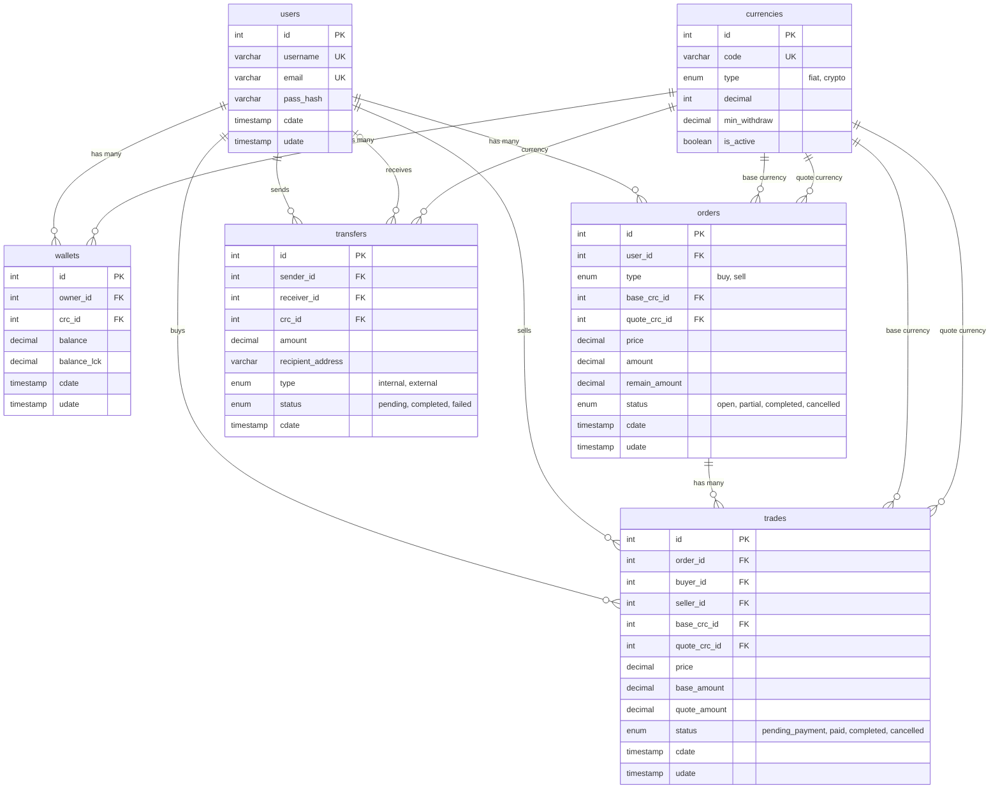

# ER Diagram

This directory contains the database design for the Crypto C2C Exchange.

## 1. Visual Diagram

*(Note: Replace `ERDiagram.png` with the actual exported image from dbdiagram.io or your preferred tool)*

## 2. DBML Code for dbdiagram.io

You can copy and paste the contents of the `schema.dbml` file in this directory into [dbdiagram.io](https://dbdiagram.io) to generate or edit the visual diagram (for better visualization and interactivity).

## 3. Mermaid Diagram

You can also view the ER Diagram via Mermaid directly on GitHub:

