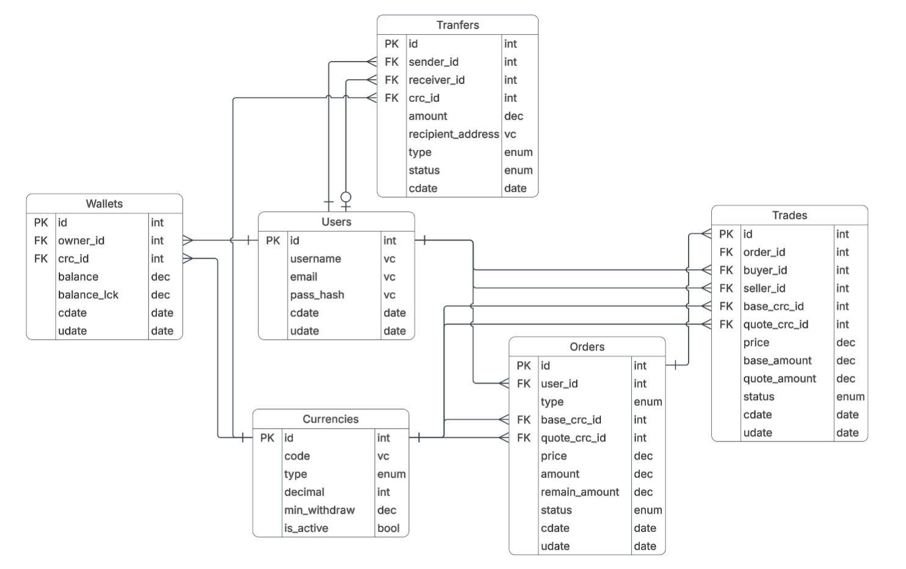
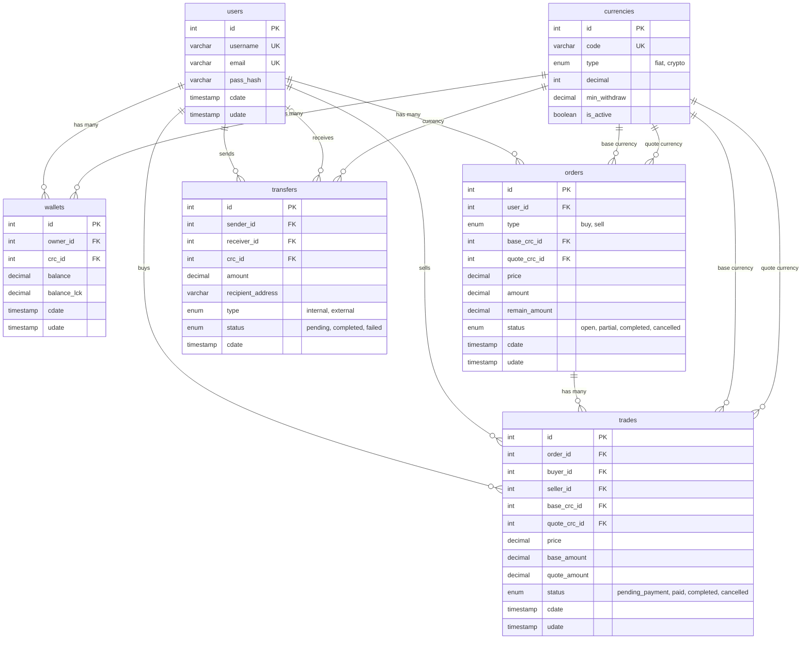

# Crypto C2C Exchange - NodeJS Demo API


A peer-to-peer (C2C) cryptocurrency exchange REST API built with Node.js, Express, Sequelize, and SQLite.

Users can buy and sell cryptocurrencies (BTC, ETH, XRP, DOGE) using fiat currencies (THB, USD) by creating orders and matching with other users in the system.

## Tech Stack

| Component | Tech                |
| --------- | ------------------- |
| Runtime   | Node.js             |
| Framework | Express 5           |
| ORM       | Sequelize 6         |
| Database  | SQLite 3            |
| Auth      | JWT + bcrypt        |
| API Docs  | Swagger (OpenAPI 3) |

#### Technology Choices:
- **Node.js**: Excellent for I/O-heavy applications like REST APIs. Its asynchronous, event-driven architecture is perfect for handling multiple simultaneous requests efficiently.
- **Express 5**: A fast, minimalist web framework. Version 5 natively supports Promises for `async/await` routing, eliminating the need for boilerplate `try/catch` wrappers or external libraries like `express-async-errors`.
- **Sequelize 6**: A mature ORM that provides robust **transaction support** with row-locking (crucial for a financial application to ensure ACID properties). It is also database-agnostic, meaning the project can easily be migrated to PostgreSQL or MySQL in the future.
- **SQLite 3**: A zero-configuration, serverless database. This was chosen specifically for the exam to ensure reviewers can simply run `npm install` and `npm start` without needing to set up a local database server.
- **JWT + bcrypt**: The industry standard for stateless, secure authentication and password hashing.
- **Swagger**: Provides an interactive UI for testing APIs out-of-the-box. This drastically improves the developer experience for reviewers, eliminating the need to import external Postman collections.


## Table of Contents
- [ER Diagram](#er-diagram)
- [Setup & Run](#setup--run)
- [API Endpoints](#api-endpoints)
- [Trading Flow](#trading-flow)
- [Test Accounts (after seeding)](#test-accounts-after-seeding)
- [API Testing Walkthrough (Swagger)](#api-testing-walkthrough-swagger)
- [Project Structure](#project-structure)

## ER Diagram

### 1. Visual Diagram (from Lucidchart)



#### Database Design Rationale:
- **`users`**: Stores only authentication data. Keeping balances out of the `users` table prevents unnecessary row locks during trades and simplifies auditing.
- **`currencies`**: Support both fiat and crypto uniformly. The `is_active` flag allows temporarily disabling a currency for maintenance without deleting records.
- **`wallets` (Multi-currency support)**: Structured as "1 wallet per user per currency" using a unique constraint on `(owner_id, crc_id)`. 
  - **`balance` vs `balance_lck`**: A critical design choice. When a user places an order, funds are moved from `balance` (available) to `balance_lck` (reserved) to prevent double-spending before the order is matched or cancelled.
- **`orders`**: Represents the user's "intent" to trade. Uses separate `base_crc_id` and `quote_crc_id` to dynamically support any trading pair (e.g., BTC/THB) without creating separate tables per pair. 
  - **Partial Fills**: The `remain_amount` field ensures that an order can be partially bought (e.g., selling 1 BTC, but someone only buys 0.3 BTC) instead of an unrealistic all-or-nothing constraint.
- **`trades`**: Represents the actual execution. A strict 1-to-Many relationship with `orders` (due to partial fills). 
  - **Denormalization for Performance**: Fields like `buyer_id`, `seller_id`, and currencies are duplicated here. This slight trade-off in normalization vastly improves read-heavy queries for trade histories without needing complex JOINs.
- **`transfers`**: Strictly isolated from trading logic. Represents direct money movement (no matching/pricing). 
  - **Internal vs. External**: The nullable `receiver_id` handles internal P2P transfers, while `recipient_address` handles external blockchain/bank withdrawals within the same table.
- **Enums for Data Integrity**: Database-level enums (`order_status`, `trade_status`) tightly enforce the state machine, preventing invalid statuses that could negatively impact a user's funds.

### 2. DBML Code for dbdiagram.io

You can copy and paste the contents of the [`ERDiagram.dbml`](./ERDiagram.dbml) file in this directory into [dbdiagram.io](https://dbdiagram.io) to generate or edit the visual diagram (for better visualization and interactivity).

### 3. Mermaid Diagram

View the ER Diagram via Mermaid directly on GitHub:



## Setup & Run

### Prerequisites

- [Node.js](https://nodejs.org/) v18 or later

### Installation

```bash
# 1. Clone the repository
git clone https://github.com/LunarLight-cn/CryptoBackendExam.git
cd CryptoBackendExam

# 2. Install dependencies
npm install

# 3. Create a .env file
#    (You can simply rename or copy .env.example to .env)
copy .env.example .env

# 4. Seed the database with test data
npm run seed

# 5. Start the server
npm start
```

The server will be running at **http://localhost:3000** (or the PORT specified in `.env`).

### API Documentation (Swagger)

Open **http://localhost:3000** in your browser to explore the interactive Swagger API docs.

## API Endpoints

### Auth

| Method | Endpoint        | Auth | Description               |
| ------ | --------------- | ---- | ------------------------- |
| POST   | `/api/register` | No   | Register a new user       |
| POST   | `/api/login`    | No   | Login and get a JWT token |

### Orders (C2C)

| Method | Endpoint                 | Auth | Description                                   |
| ------ | ------------------------ | ---- | --------------------------------------------- |
| GET    | `/api/orders`            | No   | List all orders (with filters)                |
| GET    | `/api/orders/:id`        | No   | Get a single order by ID                      |
| POST   | `/api/orders`            | Yes  | Create a new buy/sell order                   |
| PATCH  | `/api/orders/:id/cancel` | Yes  | Cancel an order and release locked funds      |

### Trades

| Method | Endpoint                | Auth | Description                                  |
| ------ | ----------------------- | ---- | -------------------------------------------- |
| POST   | `/api/orders/:id/trade` | Yes  | Accept an order and complete trade instantly  |
| GET    | `/api/trades`           | Yes  | Get your trade history                       |

### Wallets & Transfers

| Method | Endpoint         | Auth | Description                        |
| ------ | ---------------- | ---- | ---------------------------------- |
| GET    | `/api/wallets`   | Yes  | View your wallet balances          |
| POST   | `/api/transfers` | Yes  | Transfer coins (internal/external) |
| GET    | `/api/transfers` | Yes  | View your transfer history         |

## Trading Flow

```
1. Register     →  POST /api/register
2. Login        →  POST /api/login  (get JWT token)
3. View Orders  →  GET  /api/orders  (browse available orders)
4. Create Order →  POST /api/orders  (create a buy or sell order)
5. Execute Trade→  POST /api/orders/:id/trade  (accept someone's order)
   → Crypto is transferred to buyer, fiat to seller instantly
6. Cancel Order →  PATCH /api/orders/:id/cancel  (release locked funds)
```

## Test Accounts (after seeding)

| Username | Email            | Password    |
| -------- | ---------------- | ----------- |
| jane     | jane@example.com | password123 |
| john     | john@example.com | password123 |
| alex     | alex@example.com | password123 |

### Seeded Sample Data

| Type    | Description                                                        | Status  |
| ------- | ------------------------------------------------------------------ | ------- |
| Order 1 | Jane sells 0.5 BTC @ 100,000 THB/BTC (0.3 traded, 0.2 remaining) | partial |
| Order 2 | Alex buys 100 XRP @ 20 THB/XRP                                    | open    |
| Trade 1 | John bought 0.3 BTC from Jane @ 100,000 THB/BTC = 30,000 THB     | completed |

> Wallet balances in the seed are pre-calculated to reflect the state **after** these orders and trades (e.g. Jane's BTC: balance=1.5, locked=0.2).

## API Testing Walkthrough (Swagger)

You can use the following step-by-step scenario to test the API via Swagger UI (`http://localhost:3000`).

**How to use Swagger UI:**

1. Click on an API endpoint (e.g., `POST /api/login`) to expand it.
2. Click the **"Try it out"** button on the right side.
3. If the endpoint requires a Request Body, paste the provided JSON into the input box.
4. Click the big blue **"Execute"** button.
5. Scroll down to the **"Responses"** section to view the result in the **"Response body"**.

### Phase 1: Authentication

**1. Login as Jane**

- **API**: `POST /api/login`
- **Body**:
  ```json
  {
    "email": "jane@example.com",
    "password": "password123"
  }
  ```
- **Action**: Copy the `token` from the response. Click the **Authorize** button (🔓) at the top right of the Swagger page, paste the token, and click Save (🔒).

### Phase 2: Wallets & Transfers

**2. Check Balances**

- **API**: `GET /api/wallets`
- **Result**: You should see Jane's balances (e.g., 530,000 THB, 1.5 BTC available + 0.2 BTC locked).

**3. Internal Transfer (Send to a friend)**

- **API**: `POST /api/transfers`
- **Body**:
  ```json
  {
    "to_username": "john",
    "recipient_address": "",
    "crc_id": 1,
    "amount": 5000
  }
  ```
- **Result**: Jane's THB balance is deducted by 5,000, and transferred to John.

**4. External Transfer (Withdrawal)**

- **API**: `POST /api/transfers`
- **Body**:
  ```json
  {
    "to_username": "",
    "recipient_address": "0xABCDEF123456789",
    "crc_id": 3,
    "amount": 0.1
  }
  ```
- **Result**: 0.1 BTC is withdrawn to the external address. (Note: amount must meet the minimum withdrawal of 0.0001 BTC)

### Phase 3: C2C Trading

**5. Create a Sell Order**

- **API**: `POST /api/orders`
- **Scenario**: Jane wants to sell 0.5 BTC at 150,000 THB/BTC.
- **Body**:
  ```json
  {
    "type": "sell",
    "base_crc_id": 3,
    "quote_crc_id": 1,
    "price": 150000,
    "amount": 0.5
  }
  ```
- **Result**: Order is created. 0.5 BTC is moved to `balance_lck` in Jane's wallet.

**6. View Orders**

- **API**: `GET /api/orders`
- **Parameters**: `type = sell`, `status = open`
- **Result**: Take note of the `id` of the order you just created.

**7. View Order Detail**

- **API**: `GET /api/orders/{id}`
- **Parameters**: `id` = (the ID from step 6)
- **Result**: Detailed view of the order with user and currency info.

**8. Execute Trade (Matching)**

- **Action**: **Logout** from Swagger (🔓). Login again (`POST /api/login`) using John's credentials (`john@example.com` / `password123`). Authorize with John's token (🔒).
- **API**: `POST /api/orders/{id}/trade`
- **Parameters**: `id` = (the ID from step 6)
- **Body**:
  ```json
  { "amount": 0.5 }
  ```
- **Result**: Trade successful. 75,000 THB is deducted from John and sent to Jane. 0.5 BTC is unlocked and sent to John.

### Phase 4: Cancel Order

**9. Create and Cancel an Order**

- **API**: `POST /api/orders`
- **Body**:
  ```json
  {
    "type": "buy",
    "base_crc_id": 4,
    "quote_crc_id": 1,
    "price": 5000,
    "amount": 2
  }
  ```
- **Result**: Buy order for 2 ETH created. 10,000 THB (2 × 5,000) is locked.

- **API**: `PATCH /api/orders/{id}/cancel`
- **Parameters**: `id` = (the order ID from above)
- **Result**: Order is cancelled. 10,000 THB is released back to available balance.

## Project Structure

```
CryptoBackendExam/
├── app.js                  # Express app entry point + Swagger setup
├── config/
│   └── database.js         # Sequelize + SQLite configuration
├── controllers/
│   ├── AuthController.js   # Register & Login (with input validation)
│   ├── OrderController.js  # Create, list, detail, and cancel orders
│   ├── TradeController.js  # Trade execution (accept orders)
│   └── WalletController.js # Wallet queries, transfers (with min_withdraw check)
├── middleware/
│   └── auth.js             # JWT verification middleware
├── models/
│   ├── index.js            # Model associations (relationships)
│   ├── User.js
│   ├── Currency.js
│   ├── Wallet.js
│   ├── Order.js
│   ├── Trade.js
│   └── Transfer.js
├── routes/
│   └── api.js              # RESTful API route definitions + Swagger docs
├── seeders/
│   └── seed.js             # Database seed script (users, currencies, orders, trades)
├── ERDiagram.dbml          # DBML code for dbdiagram.io
├── ERDiagram.png           # Visual ER diagram image
├── .env.example            # Environment variables template
├── .gitignore
├── package.json
└── README.md
```
